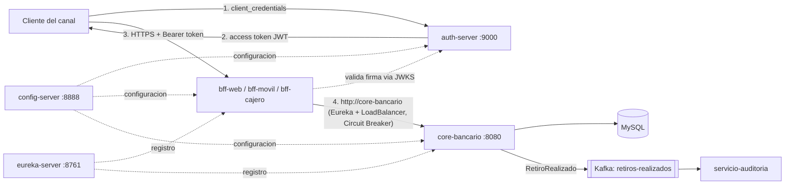

# Banco XYZ – Microservicios con Spring Cloud

## 1. Objetivo

Sistema bancario de microservicios para el Banco XYZ: un **core bancario** que concentra los datos y las operaciones de las cuentas, y **tres BFF (Backend for Frontend)**, uno por canal (web, móvil y cajero automático), que adaptan esas operaciones a lo que necesita cada canal. La plataforma usa Spring Cloud para la configuración centralizada (Config Server), el descubrimiento de servicios (Eureka) y la resiliencia (Resilience4j), OAuth2 para la seguridad, Kafka para la mensajería asíncrona y Docker Compose para levantar todo el sistema.

Tecnologías: Java 17, Spring Boot 4.1.0, Spring Cloud 2025.1.2, Spring Security 7 (Authorization Server y Resource Server), Spring Batch, Spring Kafka, MySQL 8, Apache Kafka (KRaft), Maven multi-módulo y Docker.

## 2. Arquitectura y estructura del código

El `pom.xml` de la raíz es el POM padre/agregador: centraliza las versiones (Spring Boot, Spring Cloud, Java 17) y declara los 8 módulos, cada uno con su propio `pom.xml`:

| Módulo | Puerto | Rol |
|---|---|---|
| `config-server` | 8888 | Configuración centralizada; sirve los secretos cifrados (`{cipher}`) de `config-repo/` ya descifrados. |
| `eureka-server` | 8761 | Service Discovery: core y BFF se registran y se encuentran por nombre lógico. |
| `auth-server` | 9000 | Authorization Server OAuth2: emite tokens JWT con el flujo `client_credentials`. |
| `core-bancario` | 8080 | API interna de cuentas, transacciones y retiros (MySQL); publica eventos en Kafka. Contiene también los jobs batch. |
| `bff-web` | 8081 | BFF del canal web (HTTPS): cuenta con estado anual, movimientos y transacciones. |
| `bff-movil` | 8082 | BFF del canal móvil (HTTPS): datos esenciales de la cuenta y últimos 10 movimientos. |
| `bff-cajero` | 8083 | BFF del cajero (HTTPS): saldo, validación de cuenta y retiro. |
| `servicio-auditoria` | 8084 | Consume los eventos de retiro desde Kafka y los registra en el log. |

Docker Compose agrega dos servicios de infraestructura: `mysql` y `kafka`.



Cada BFF sigue la estructura `controller → service → client`: el `CoreClient` llama a la API interna de Core (`/api/core/**`) usando el nombre lógico `core-bancario`, que Eureka y Spring Cloud LoadBalancer resuelven a una instancia real.

### Endpoints de los BFF

| BFF | Método | Endpoint |
|---|---|---|
| web | GET | `/api/web/cuentas/{cuentaId}`, `/api/web/cuentas/{cuentaId}/movimientos` |
| web | GET | `/api/web/transacciones`, `/api/web/transacciones/{id}` |
| móvil | GET | `/api/movil/cuentas/{cuentaId}`, `/api/movil/cuentas/{cuentaId}/movimientos` |
| cajero | GET | `/api/cajero/cuentas/{cuentaId}/saldo`, `/api/cajero/cuentas/{cuentaId}/validar` |
| cajero | POST | `/api/cajero/cuentas/{cuentaId}/retiro` con cuerpo `{ "monto": 500 }` |

Un retiro con saldo insuficiente responde `409 Conflict` con `{ "mensaje": "Saldo insuficiente para realizar el retiro" }`.

### Procesos batch (core-bancario)

`core-bancario` conserva los tres jobs de Spring Batch que migraron los procesos legacy (`transaccionesJob`, `interesesJob` y `cuentasAnualesJob`, con particionamiento, multithreading, SkipPolicy y RetryPolicy). Sus resultados son los datos de `db/init/01-datos.sql`. Con `spring.batch.job.enabled=false` los jobs no se ejecutan al arrancar el servicio.

## 3. Cómo ejecutar

### Requisitos

- Docker Desktop (con Docker Compose v2).
- Puertos libres en el host: 3307, 8081, 8082, 8083, 8761, 8888 y 9000.

### Levantar el sistema

Desde la raíz del repositorio:

```
docker compose up -d --build
```

`--build` construye las 8 imágenes `banco/<modulo>:latest`; si ya están construidas basta con `docker compose up -d`. Los servicios arrancan en orden según sus dependencias (`depends_on` con `healthcheck`): primero `mysql`, `kafka`, `config-server` y `eureka-server`; luego `auth-server`; después `core-bancario`, y al final los tres BFF. Hay que esperar a que todos figuren como `healthy`:

```
docker compose ps
```

Luego de que estén `healthy`, conviene esperar unos 30 segundos antes de la primera llamada a un BFF: Eureka tarda en propagar el registro de `core-bancario` y, mientras tanto, el BFF puede responder `503`.

La base de datos se carga automáticamente desde `db/init/01-datos.sql` la primera vez que se crea el volumen de MySQL (cuentas, transacciones, movimientos y estados de cuenta anuales). Los usuarios de la tabla `usuarios` los crea `core-bancario` al arrancar.

### URLs útiles

- Dashboard de Eureka: http://localhost:8761
- Config Server: http://localhost:8888/{servicio}/default
- Authorization Server (token): http://localhost:9000/oauth2/token
- BFF web, móvil y cajero: https://localhost:8081, https://localhost:8082, https://localhost:8083
- MySQL: `localhost:3307` (usuario `root`, base `banco_xyz`)

`core-bancario` y `servicio-auditoria` no publican puertos: solo son accesibles dentro de la red de Docker Compose. Core no tiene autenticación propia, por eso se expone únicamente a través de los BFF.

### Apagar

```
docker compose down       # detiene y elimina los contenedores; los datos de MySQL se conservan
docker compose down -v    # además borra el volumen de MySQL (la próxima vez se recarga desde db/init)
```

### Escalar el servicio de auditoría

```
docker compose up -d --scale servicio-auditoria=2
```

Las dos instancias comparten el grupo de consumidores `auditoria`, así que Kafka reparte entre ellas las 2 particiones del topic.

### Ejecución local sin Docker

Cada servicio lee `CONFIG_SERVER_URL` y `EUREKA_URL` con `localhost` como valor por defecto, así que también se pueden ejecutar los jars directamente. Requiere MySQL en `localhost:3306` y un broker Kafka en `localhost:9092`. Primero se compila con `./mvnw clean install`: el test `BatchApplicationTests` necesita `config-server` corriendo, o bien se usa `-DskipTests`. Después se levanta cada módulo con `java -jar <modulo>/target/<modulo>-0.0.1-SNAPSHOT.jar` en este orden: `config-server`, `eureka-server`, `auth-server`, `core-bancario`, los BFF y `servicio-auditoria`.

## 4. Seguridad OAuth2

- **Authorization Server** (`auth-server`, Spring Security 7): emite access tokens JWT firmados con **RS256** mediante el flujo **client_credentials**.
- **Un cliente por canal**, autenticado con `client_secret_basic`, con tokens de 1 hora:

| Cliente | Scope | BFF que lo acepta |
|---|---|---|
| `web-client` | `web` | bff-web (exige `SCOPE_web`) |
| `movil-client` | `movil` | bff-movil (exige `SCOPE_movil`) |
| `cajero-client` | `cajero` | bff-cajero (exige `SCOPE_cajero`) |

- **Los BFF son resource servers**: validan la firma de cada token con las claves públicas que publica `auth-server` en `/oauth2/jwks` y exigen el scope de su canal. Sin token responden `401`, y con el token de otro canal responden `403`. Son stateless y no tienen endpoint de login propio.
- **Los secretos de los clientes** no están en el código: se guardan cifrados (`{cipher}...`) en `config-server/src/main/resources/config-repo/auth-server.properties`. Con el sistema levantado, el Config Server los entrega descifrados:

```
curl http://localhost:8888/auth-server/default
```

### Ejemplo: token del cajero y consulta de saldo

PowerShell 5.1 (reemplazar `<secreto-cajero>` por el valor obtenido del Config Server; el `\"` del cuerpo JSON es el escape que necesita `curl.exe` en esa versión):

```powershell
$basic = [Convert]::ToBase64String([Text.Encoding]::ASCII.GetBytes("cajero-client:<secreto-cajero>"))
$token = (Invoke-RestMethod -Method Post -Uri http://localhost:9000/oauth2/token `
    -Headers @{ Authorization = "Basic $basic" } `
    -Body @{ grant_type = "client_credentials"; scope = "cajero" }).access_token

curl.exe -k -H "Authorization: Bearer $token" https://localhost:8083/api/cajero/cuentas/108/saldo
curl.exe -k -X POST -H "Authorization: Bearer $token" -H "Content-Type: application/json" `
    -d '{\"monto\": 100}' https://localhost:8083/api/cajero/cuentas/108/retiro
```

Con curl (bash):

```
curl -s -u cajero-client:<secreto-cajero> -d grant_type=client_credentials -d scope=cajero http://localhost:9000/oauth2/token
curl -k -H "Authorization: Bearer <access_token>" https://localhost:8083/api/cajero/cuentas/108/saldo
```

`-k` es necesario porque los BFF usan HTTPS con un certificado autofirmado (`keystore.p12` en los recursos de cada BFF). La contraseña del keystore también llega cifrada desde el Config Server.

## 5. Mensajería con Kafka

- **Productor**: `core-bancario`. Cuando un retiro se completa con éxito, después de guardar el nuevo saldo, publica el evento `RetiroRealizado` (`cuentaId`, `monto`, `nuevoSaldo`, `fecha`) en formato JSON.
- **Topic**: `retiros-realizados`, con 2 particiones, y la clave del mensaje es el `cuentaId`, así que los eventos de una misma cuenta quedan siempre en la misma partición y en orden. Si Kafka no está disponible, el retiro se completa igual: la falla al publicar solo se registra en el log de Core.
- **Consumidor**: `servicio-auditoria`, en el grupo `auditoria`. Registra cada evento con su partición, offset y payload:

```
docker compose logs servicio-auditoria
```

```
[AUDITORIA] instancia=puerto 8084 | particion=1 | offset=0 | payload={"cuentaId":108,"monto":100.0,"nuevoSaldo":...,"fecha":"..."}
```

Con el servicio escalado, todas las instancias muestran el puerto 8084, que es el interno de cada contenedor. Para distinguirlas hay que mirar el prefijo de cada línea en `docker compose logs`, que trae el nombre del contenedor (`servicio-auditoria-1`, `servicio-auditoria-2`).

## 6. Resiliencia

Cada BFF protege sus llamadas a Core con un **circuit breaker de Resilience4j** llamado `core`:

- Ventana de las últimas 4 llamadas; se abre cuando falla el 50 % o más.
- Abierto durante 10 s; luego pasa a semiabierto y deja pasar 2 llamadas de prueba.
- **Fallback**: si Core no responde o el circuito está abierto, el BFF devuelve `503 Service Unavailable` con un mensaje controlado en lugar de un error 500.
- En `bff-cajero`, los errores de negocio de Core (por ejemplo, el `409` por saldo insuficiente) no cuentan como fallas y se devuelven tal cual.

El estado del circuito se consulta en `/actuator/circuitbreakers` de cada BFF, con un token del canal:

```
curl.exe -k -H "Authorization: Bearer $token" https://localhost:8083/actuator/circuitbreakers
```

Para probarlo:

```
docker compose stop core-bancario
```

Al repetir varias veces una llamada al BFF, las primeras fallan al intentar conectar, y a partir de ahí el circuito pasa a `OPEN` y el BFF responde `503` de inmediato. Con `docker compose start core-bancario`, y pasados los 10 s, el circuito vuelve a `CLOSED` y las llamadas funcionan otra vez.

## 7. Imágenes Docker

Cada módulo tiene su propio `Dockerfile` multi-stage (por ejemplo, `core-bancario/Dockerfile`), construido con la raíz del repositorio como contexto:

- **Etapa build**: `maven:3.9-eclipse-temurin-17` compila solo el módulo y sus dependencias (`mvn -pl <modulo> -am package -DskipTests`), con caché de dependencias de Maven.
- **Etapa runtime**: `eclipse-temurin:17-jre` con únicamente el jar, ejecutado con un usuario sin privilegios.

Las imágenes se llaman `banco/<modulo>:latest`. Para construir una sola:

```
docker build -f <modulo>/Dockerfile -t banco/<modulo>:latest .
```

El `.dockerignore` excluye, entre otros, `target/`, `.git`, `db/` y `docker-compose.yaml`, para que el contexto sea liviano y los cambios en esos archivos no invaliden la caché de construcción.

## 8. Limitaciones conocidas

- La clave de cifrado del Config Server (`encrypt.key`) y la contraseña de MySQL (en `docker-compose.yaml`) están en texto plano en el repositorio. Es aceptable solo como entorno académico; en un entorno real se inyectarían como secretos, por ejemplo con variables de entorno o un gestor de secretos.
- La tabla `usuarios` y el endpoint `/api/core/auth/validar` de Core siguen existiendo, pero ya no se usan para autenticar: la autenticación de los canales la resuelve OAuth2.
- `auth-server` genera su clave RSA en memoria al arrancar: si se reinicia, cambia la clave y los tokens emitidos antes dejan de ser válidos.
- Los clientes OAuth2 se registran en memoria dentro de `auth-server`; agregar o modificar un cliente requiere cambiar el código y volver a desplegar.
- Los cambios en `config-repo/` requieren reconstruir la imagen de `config-server`, porque los archivos se sirven desde el classpath.

## 9. Evidencias

Las evidencias de ejecución de esta entrega (despliegue con Docker Compose, registro en Eureka, obtención de tokens OAuth2 y llamadas a los BFF, eventos de Kafka y pruebas del circuit breaker) se encuentran en la carpeta de evidencias incluida en la entrega.
